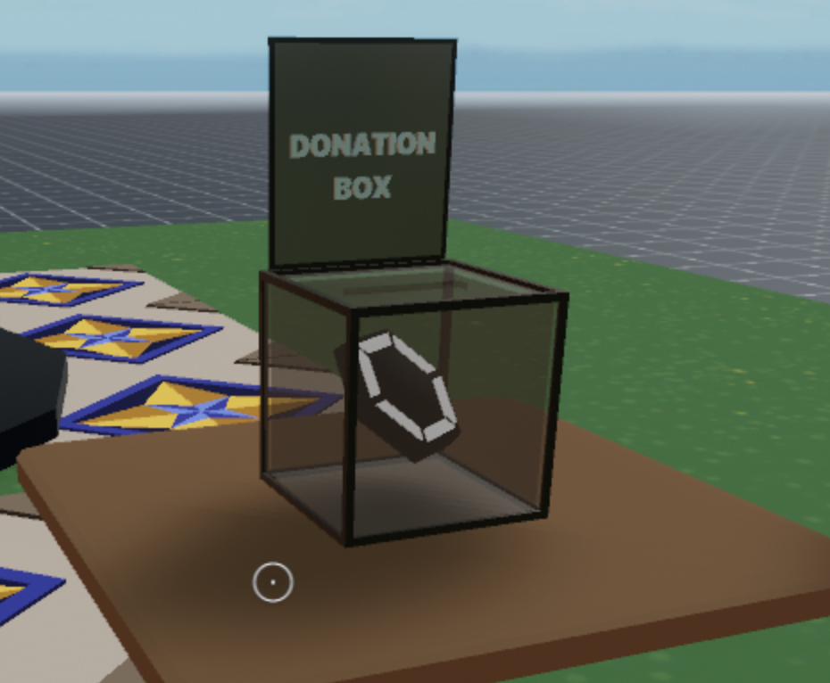

# Donations Box

A simple scene that uses the `decentraland-crypto-utils` library to make a MANA payment when a player clicks on a donations box

The crypto Utils function makes it a lot simpler to perform blockchain functions. Sending MANA from one account to another just takes one line of code using this library.



Feel free to reuse the models and code from this scene!

**Install the CLI**

Download and install the Decentraland CLI by running the following command

```bash
npm i -g decentraland
```

For a more details, follow the steps in the [Installation guide](https://docs.decentraland.org/documentation/installation-guide/).

**Previewing the scene**

Once you've installed the CLI, download this example and navigate to its directory from your terminal or command prompt.

_from the scene directory:_

```
$:  dcl start
```

Any dependencies are installed and then the CLI will open the scene in a new browser tab automatically.

Paste the following to the end of the URL in the browser window:

```
&ENABLE_WEB3
```

For example, if the URL is `http://127.0.0.1:8000?position=0%2C0&SCENE_DEBUG_PANEL`, make it `http://127.0.0.1:8000?position=0%2C0&SCENE_DEBUG_PANEL&ENABLE_WEB3`

Learn more about how to build your own scenes in our [documentation](https://docs.decentraland.org/) site.

## Copyright info

This scene is protected with a standard Apache 2 licence. See the terms and conditions in the [LICENSE](/LICENSE) file.
